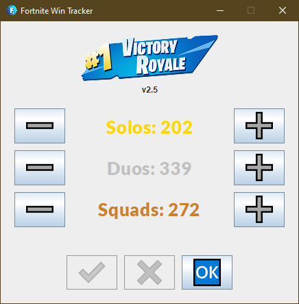
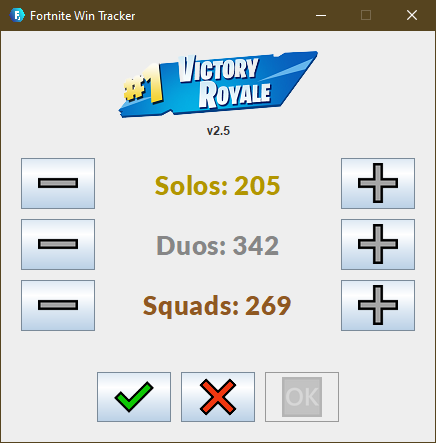

# Fortnite Win Tracker 2

## Overview
Fortnite Win Tracker 2 is a desktop application that allows users to update and track their victories across different game modes in Fortnite: Battle Royale. Initially developed in Python during the COVID-19 lockdown, this project has been upgraded using Java and Java GUI frameworks to enhance functionality and user experience. This application is part of a personal project to explore advanced programming techniques and user interface design.

## Screenshots

### Main GUI

The main interface of the Fortnite Win Tracker 2 features a vibrant "Victory Royale" image to stay true to the Fortnite theme. The GUI displays the current win totals for each game mode, with intuitive plus and minus buttons on either side to adjust these values easily. Below, there are buttons to 'Save' changes, 'Discard' any unsaved modifications, and 'Quit' the application, ensuring a user-friendly experience that mirrors the dynamic gameplay of Fortnite.

### Editing Values

When editing win counts, the values are visually highlighted to indicate unsaved changes, providing a clear, immediate visual cue that modifications have been made. This feature helps prevent accidental data loss and supports precise user input management.

## Features
- **Win Tracking**: Users can enter and view their total wins for each game mode.
- **Data Persistence**: Wins are recorded and stored locally, allowing users to keep track over time.
- **Interactive GUI**: Utilizes Java Swing to provide a responsive and intuitive interface.
- **Live Data Updates**: Changes in wins are immediately reflected in the GUI from the stored data.

## Learning Outcomes
Through the development of Fortnite Win Tracker 2, I have gained proficiency in several technical areas:
- **File Handling**: Reading from and writing to files to manage data persistence.
- **Java Swing Components**: Implementing and managing JButton functionalities within Java GUIs.
- **GUI Design**: Understanding and applying Java GUI intricacies for effective user interaction.
- **Data Representation**: Dynamically displaying text from file data on the GUI.

## Getting Started
To run Fortnite Win Tracker 2 on your local machine, follow these steps:

### Prerequisites
Ensure you have the following installed:
- Java JDK 11 or higher
- Your preferred IDE (e.g., IntelliJ IDEA, Eclipse)

### Installation
1. Clone the repository.
2. Open the project in your IDE.
3. Build and run the application.

> [!NOTE]
> The program will create a new, empty text file (`wins.txt`) if none exists at the hardcoded directory.
